# Time Series
## Definition
It is a set of subsequent observations recorded over time. They are typically recorded with a regular and fixed 
frequency (e.g., hourly, daily, monthly, etc.).

## Problem Definition
### Requirements
Upon defining a Time Series Forecasting, it is required to establish:
1. What information is available at the time a forecast is made (features)
2. The time period during which you require forecasted values (target)

### Terminology
- **Forecast Origin** - The first data point to make forecast onward. It can be seen as the last training data point
- **Forecast Horizon** - The time interval in the future that has to be forecasted
- **Lead Time or Latency** - Time between the origin and horizon
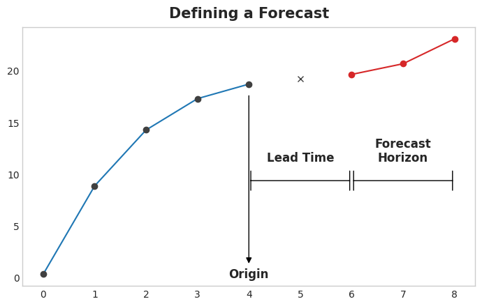

## Features
There are different types of features when talking about Time Series:
- *Time-Step Features*
- *Lag Features*

### Time-Step Features
Time-step features are features we can derive directly from the time index. 
The most basic time-step feature is the **Time Dummy**, which counts off time steps in the series from beginning to end.

For example, the **Time** column in the following example:


The Time-Step features model the so-called **Time Dependence**: series is time-dependent if its values can be predicted 
from the time they occurred. For example, in the *Hardcover Sales* series, the sales later in the month are
generally higher than sales earlier in the month.

### Lag Features
They shift the observations of the target series so that they appear to have occurred later in time.

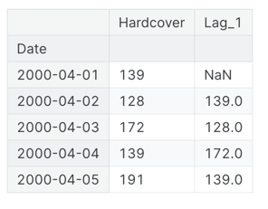

The Lag features model the so-called **Serial Dependence**: time series has serial dependence when an 
observation can be predicted from previous observations. In *Hardcover Sales*, we can predict that high sales on one 
day usually mean high sales the next day.

### Stationary and Differencing
A Time Series is said to be *Stationary* is it does not exhibit any Trend or Seasonality.
Any fluctuations within the Time Series are related to the noise or random elements.

One way to transform Time Series from Non-Stationary (has trend and seasonality) to Stationary
is to use a technique called Differecing: it subtracts to the original Time Series values the 
shifted values of the time series.

```python
# First Order Differencing
data['Values'] - data['Values'].shift(1)

# Equivalent to
from statsmodels.tsa.statespace.tools import diff
diff(data['Values'], k_diff=1)
```


# Trend
The **Trend** component of a time series represents a persistent, long-term change in the mean of the series.
The trend is the slowest-moving part of a series, the part representing the largest timescale of importance.

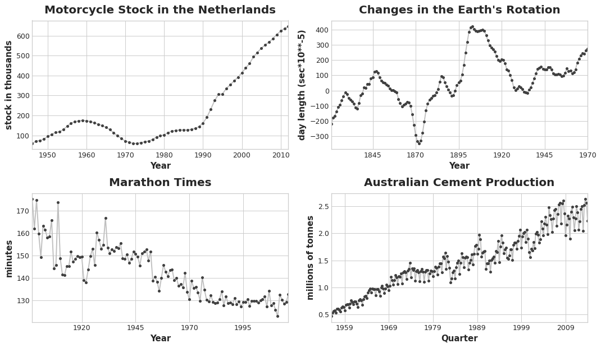

One of the most common trend is in the **mean**.

## Moving Average Plot
It is a technique used to see what kind of trend a time series might have and, in a very naive way, even to model a time series. 
It is plotted by computing the average of the values within a sliding window of some defined width.

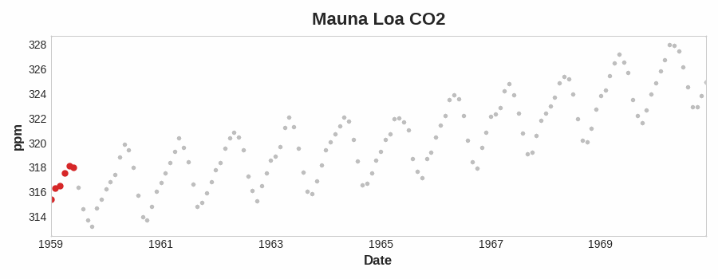

The *Mauna Loa* series above has a repeating up and down movement year after year -- a short-term, 
seasonal change. For a change to be a part of the trend, it should occur over a longer period than any seasonal changes. 
To visualize a trend, therefore, we take an average over a period longer than any seasonal period in the series. 
For the *Mauna Loa* series, we chose a window of size 12 to smooth over the season within each year.

The Moving Average is used to see a trend without the "noise" added by seasonal changes.

## Feature Engineering
A Trend can be engineered through a time-step feature, either linear or quadratic, depending on the trend type:
- `target = a * time + b`
- `target = a * time ** 2 + b * time + c`

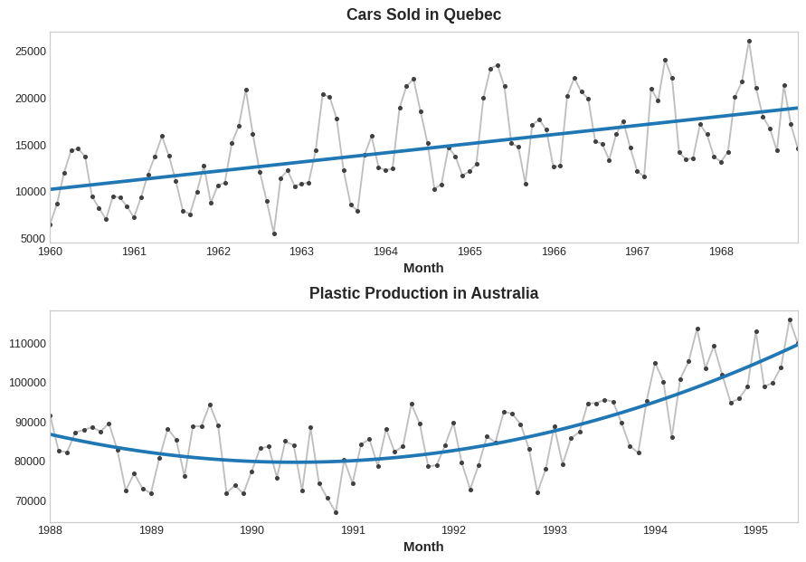

One famous example is the `Food and Beverage Sales` series, which has a so-called **Percentage Change**, which expressed
a quadratic (order 2 polynomial) trend, sometimes modeled through an exponential curve.


# Seasonality
## Definition
It is a regular and periodic change in the mean of the series. They usually follow the clock/calendar with repetitions over day, week
or year as the most common ones.

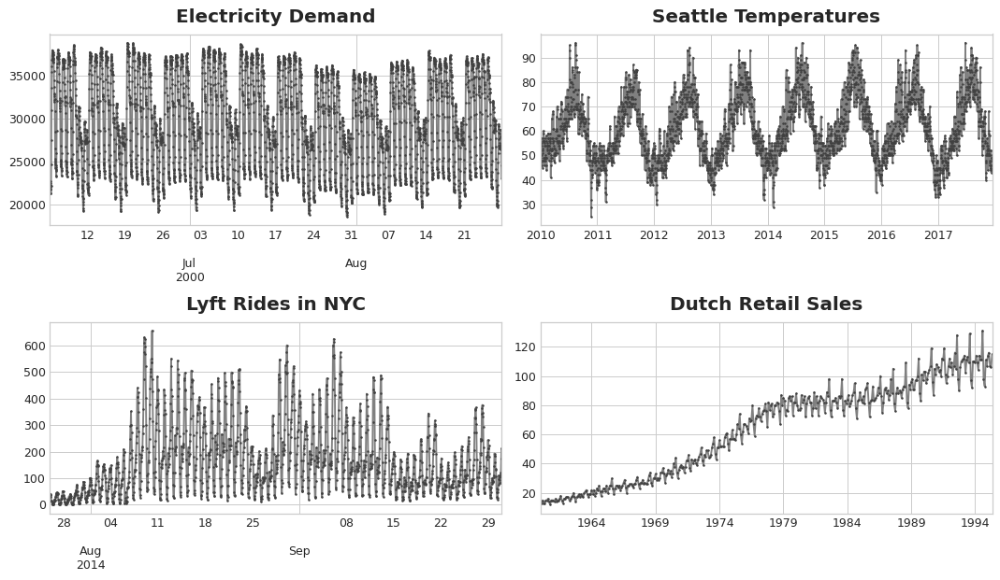

## Seasonal Plot
Like the *Moving Average* is used to uncover the trend of a time series, the *Seasonal Plot* is used to discover
seasonal patterns.

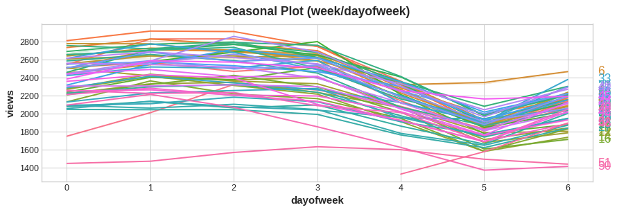

The Seasonal Plot above shows time intervals of the time series (different weeks) plotted against
a common period (days of the week). The common period is the "season" that is being observed.
The example shows a seasonal plot of the daily view of Wikipedia's article on Trigonometry, plotted over a common
"weekly" period.

## Features
There are two kinds of features that model seasonality:
- **Indicators** - It is best suited for a season with few observations (like weekly or daily observations)
- **Fourier** - It is best when having many observations (e.g., annual season with daily observations)

### Seasonal Indicators
They are binary features representing seasonal differences in the time series. They are generated by treating a seasonal
period as a categorical feature and applying one-hot encoding.

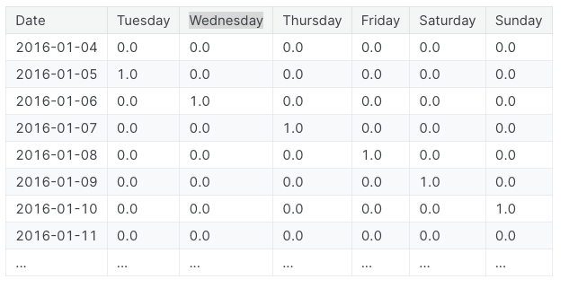

**NOTE:** Linear Regression works best if you drop of the indicators; we choose Monday.

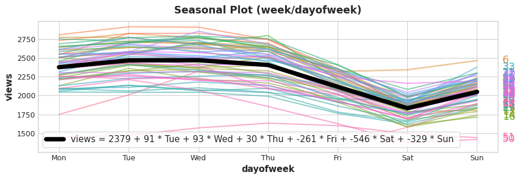

It is possible to see why we dropped Monday: it acts as the interceptors in the Linear Regression.
Indicators works as On/Off switches.

### Fourier Features
They are better suited for long seasons over many observations, where indicators might be impractical.

Let's have a look at the Seasonal Plot for the same Trigonometry Wikipedia page visits, but over a common period of a year.
There are lots of various frequencies:
- 3 long up-and-down
- Short weekly movements
- Etc.

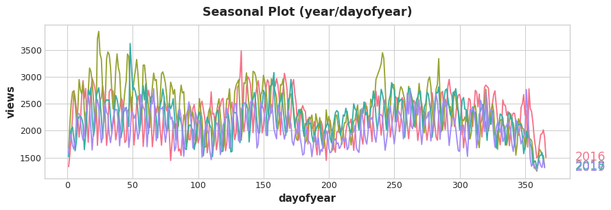

Fourier Features model such frequencies within a season through pairs of **sine and cosine curves**.
Fourier pairs modeling annual seasonality would have frequencies: once per year, twice per year, three times per year, 
and so on.
The example below shows a frequency one per year and twice per year.

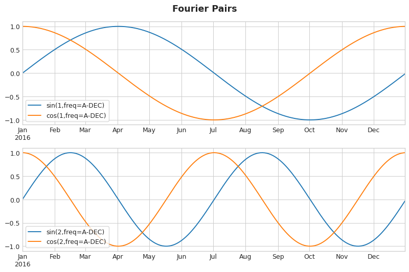

Adding such pairs of Sine and Cosine, representing Fourier Features, allows the Linear Regression to figure out the weights
for fitting them.

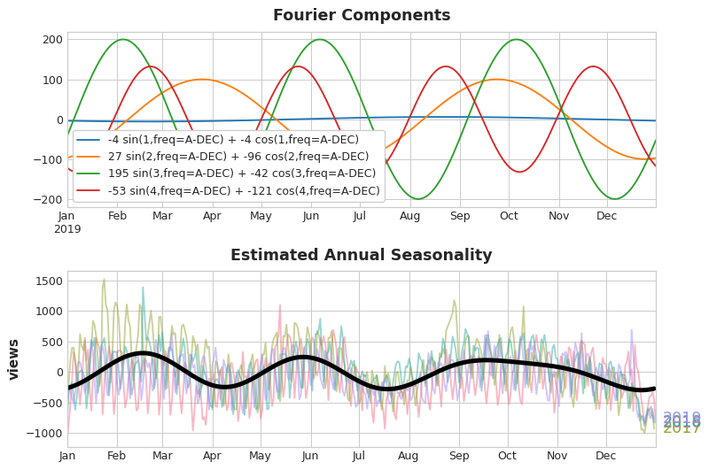

Such Fourier Features allow to well estimate annual seasonality with few features. Using the indicators, we would have need
one feature for each day of the year.

#### Periodgram
It is used to decide how many Fourier Features to include by showing the strength of the frequencies in a time series.

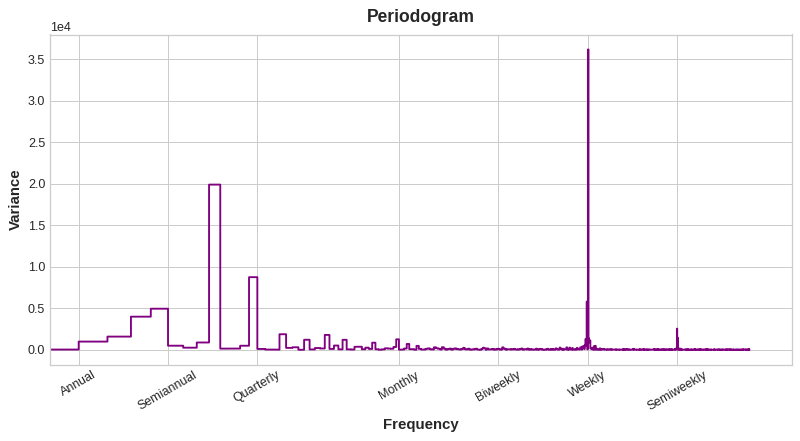

Above we have the Periodgram of the Wikipedia Trigonometry page daily visits. It drops after the *Quarterly* frequency (4 times
a year). This is the reason why it has been chosen to use 4 pairs of Fourier Features. The *Weekly* frequency has been ignored, 
since it could be modeled through the Indicators.

# Serial Dependence
With *Lag Features* we introduced the concept of **Serial Dependence**: time series has serial dependence when an 
observation can be predicted from previous observations.

The structure of these time series may not be apparent from a plot over time; 
plotted against past values, however, the structure becomes clear:

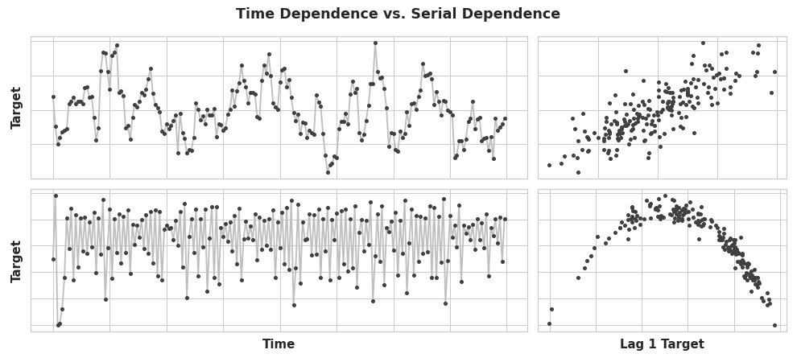

It is important not just to train models using Time Dependence features (e.g., time-step features),
but also using Serial Dependence features.

## Cycles
They are a common way for Serial Dependence to manifest. They are patterns of growth and decay in a time series. 
They are associated with how the value in a series at one time depends on values at previous times.

A Cyclic behaviour is characteristic of systems that can affect themselves or have reactions that persist over time.

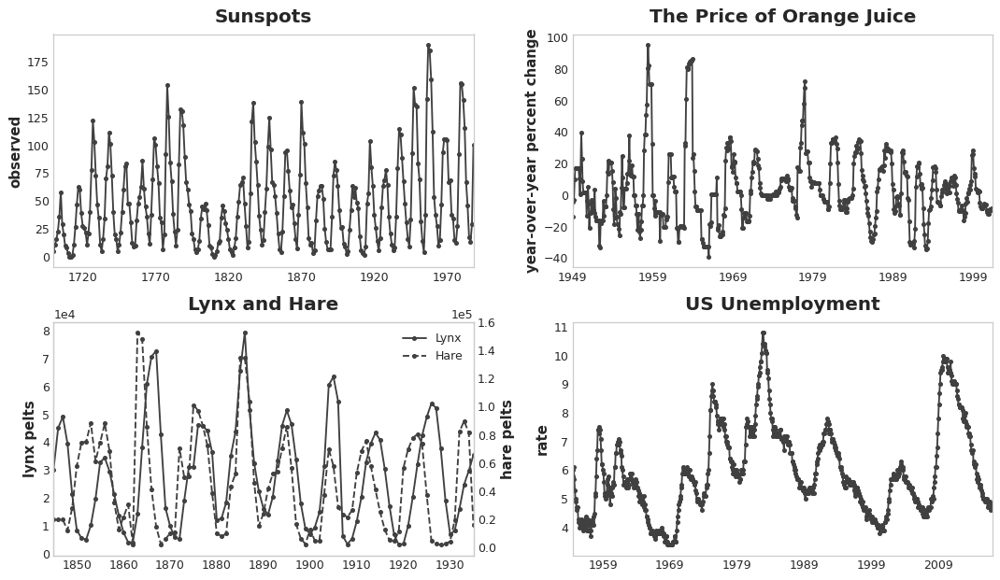

The difference between Cycles and Seasonality is that they are not necessarily time dependant, while seasons are.
What happens in a cycle is less about when it happens (date), but more about what happened before (previous time steps).

## Lagged Series
A *Lagged Series* is a copy of the original time series that it build by shifting values forward/backward one or more time steps.

It is used to investigate possible *Serial Dependencies* (like cycles).

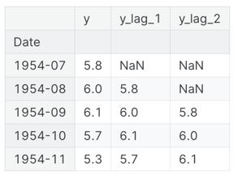.


## Lag Plots
They plot the values of a time series against its lags. This makes any Serial Dependence visible.

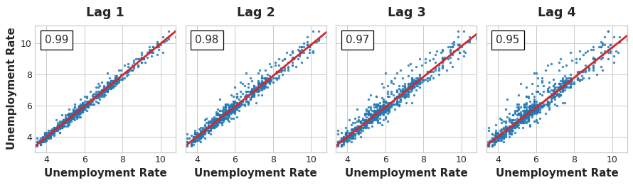

It is possible to see that, in the above *US Unemployment* time series, there is a strong and apparently 
linear relationship between the current unemployment rate and past rates.

The way of measure the Serial Dependence is the **autocorrelation** (ACF): correlation of time series with one of its lags.
It is possible to see the *US Unemployment* time series autocorrelation in the top left (e.g., 0.99 with lag 1).

## Choosing Lag Feature (ACF & PACF)
Choose the lag feature with the highest autocorrelation. The **Partial Autocorrelation** (PACF) tells the correlation 
of a lag feature with respect to of the previous lags (amount of "new" correlation the lag contributes).

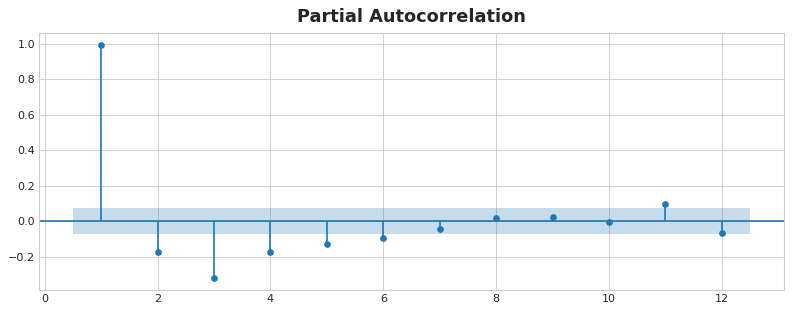

The above plot is also called **Correlogram**. It can be viewed as what the **Periodgram** does for Fourier Features.

**NOTE:** Autocorrelation and Partial Autocorrelation works only for linear dependence.


## Examples
### Flu Trend
Let's check another example of Lag Plots and Correlogram plot:

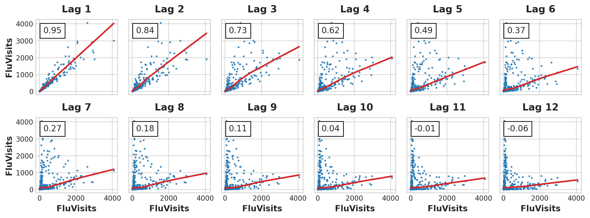

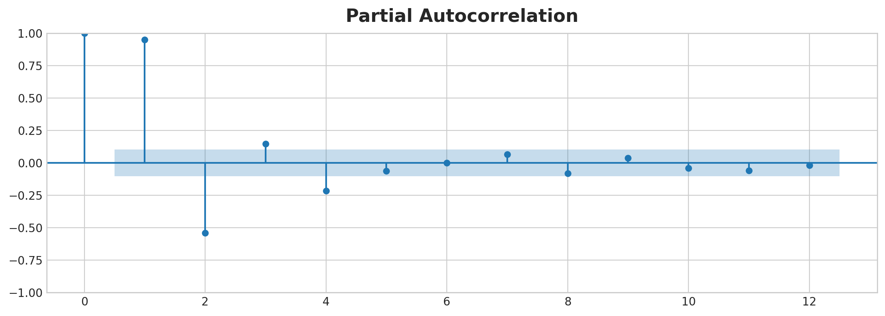

We can see from the Lag Plots that the relationship between the target (Flu Visits) and its lags is mostly linear.
In addition, from the correlogram, we can see that lags 1, 2, 3 and 4 have a good prediction power.

# Seasonal vs. Lag Features
## Dynamic
In the notebook `notebooks/flu_trends/exploratory_data_analysis.ipynb` it is possible to see that the 
Time Series has irregular cycles. Lag Features work very well in this case, because they allow the forecaster to react 
dynamically to changing conditions instead of being constrained to exact dates and times, like with seasonal features.

## Reaction
Lag Features require more time steps to react to the time series changes. This can be a limitation and
it requires to carefully plan the future time steps to forecast.

### Leading Indicators
These are other time series that might show early indicators of changing in the target time series.

# Modeling
## Time-Step & Lag Features
The best time series models will usually include some combination of time-step features and lag feature.

## Linear Regression
Linear regression is widely used in practice and adapts naturally to even complex forecasting tasks.

$` y = x_1 \cdot w_1 + \ldots + x_n \cdot w_n + b `$

## Hybrid Models or ETS Models
### Introduction
Linear Regression is useful for extrapolating trends, while XGBoost excels at learning interactions. 
These two approaches can be combined in order to create a **Hybrid** forecaster.

Sometimes these models are also called ETS: **Error-Trend-Seasonality**.
They are able to model a Time Series by decomposing it into three main components:
- **Error/Resisduals**: it represents the random fluctuations or noise
- **Trend**
- **Seasonality**

Some of these ETS models are:
- *Exponential Smoothing*
- *Trend Methods Models*
- *ETS Decomposition*

ETS models can be:
- **Additive** - The trend is more linear and trend + seasonality components seem constant over time
- **Multiplicative** - It is useful to model non-linear components

### Components and Residuals
A time series can be described as: `series = trend + seasonalities + cycles + error(unpredictable part)`.

These are called the **Components** of a time series.

The **Residuals** of a model are the difference between the labels the models was trained on and the predictions the
models makes. They are essentially what the model failed to learned about the target from the features.

The learning process can be done by learning the single **components** of a time series in a **residuals** fashion:
1. Learn the trend and subtract it out from the time series
2. Learn the seasonality and subtract it out from the previous residuals of the time series
3. Learn the cycle and subtract
4. Learn the error

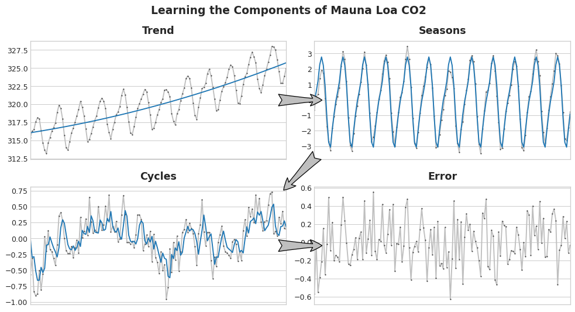

Adding together all the learned components will build the model. This is what a Linear Regression does when
it is trained on a complete set of features of trend, seasons and cycles.

One way to extract such components is the **Hodrick-Prescott** filter, which is used to separate the trend component
from the cyclic component of a time series.

### Hybrid Forecasting Theory
It is possible to use one algorithm upon certain components and another one upon the remaining ones.
This allows to always choose the best algorithm for a specific component.

The process involves training one model over the original time series and another one over the residuals:

```python
# 1. Train and predict with first model
model_1.fit(X_train_1, y_train)
y_pred_1 = model_1.predict(X_train)

# 2. Train and predict with second model on residuals
model_2.fit(X_train_2, y_train - y_pred_1)
y_pred_2 = model_2.predict(X_train_2)

# 3. Add to get overall predictions
y_pred = y_pred_1 + y_pred_2
```

The set of features in `X_train_1` and `X_train_2` is not the same. For example, the `X_train_1` might contain trend features,
while `X_train_2` might have seasonality and cycle features.

### Design Hybrid Forecaster
In practice, two models are just fine:
1. Linear model to learn trend
2. Complex non-linear model like GBDTs or a deep neural network for seasonality and cycles

The first simple linear model is ofter referred as a "helper" model for the more subsequent powerful one that follows.

## Multistep Forecasting Strategies
### Definition
It is a model that can predict multiple target steps.
There are four different strategies to model such a forecast.

### Strategies
**1. Multi-output Model**
The first strategy is to use a model that can handle multiple outputs naturally (e.g., Linear Regression and Neural Networks).
However, algorithms like XGBoost can not do that.

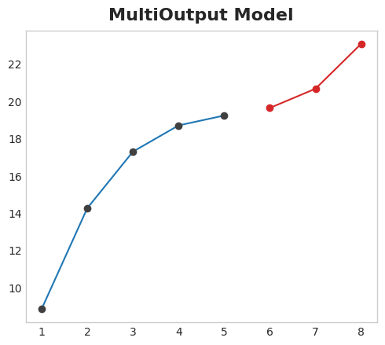

**2. Direct Strategy**
Train a separate model for each step in the **Forecast Horizon**. While this approach can be very precise, it is also
very computationally expensive.

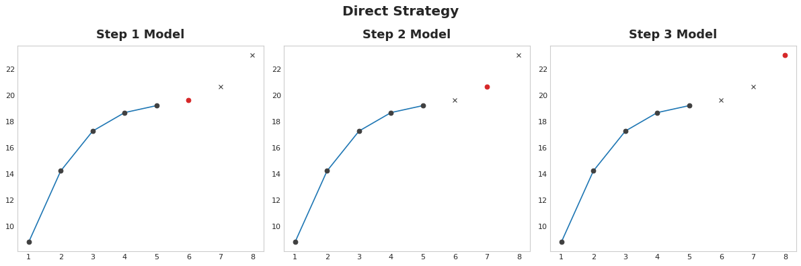

**3. Recursive Strategy**
Train a single one-step model and use its forecasts to update the lag features for the next step. This is necessary,
since one problem with lag features is that they might not be available for a defined time step 
(e.g., it is not available for the time step number "6" in the below figure).

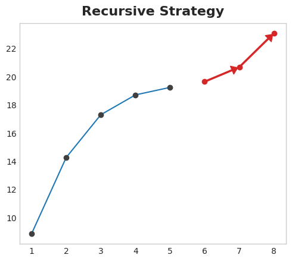

The main drawback, is that errors will propagate from step to step.

**4. DirRec Strategy**
A combination of the direct and recursive strategies: train a model for each step and use forecasts from 
previous steps as new lag features.

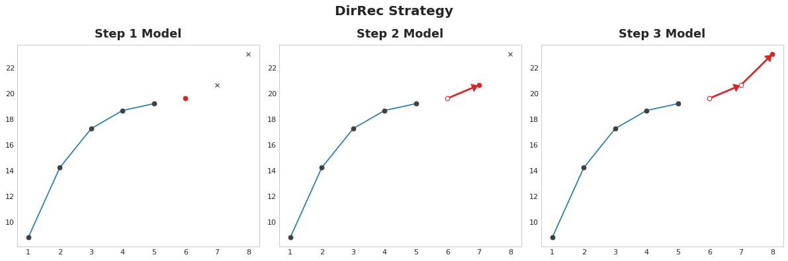

DirRec strategy can capture serial dependence better than Direct Strategy, 
but it can also suffer from error propagation like Recursive Strategy.

## Exponentially Weighted Moving Average
### Definition
Unlike Simple Moving Averages (or Moving Average), which give equal weight to all observations in a window, 
EWMA gives exponentially decreasing weights to older observations. 
This makes the EWMA more sensitive to recent changes in the data, 
which can be particularly useful for detecting trends and patterns.

### Strategy
It uses a single smoothing factors "alpha".

## Holt-Winters Methods
### Definition
It models a time series using three different equations, each one covers a component:
- l_t: level (alpha smoothing parameter)
- b_t: trend (beta smoothing parameter)
- s_t: seasonality (gamma smoothing parameter)

### Strategies
- Double Exponential Smoothing (level + trend components)
- Triple Exponential Smoothing (level + trend + seasonality components)

## ARIMA
### Introduction
It stands for *AutoRegressive Integrated Moving Average* and it is widely used.

### Drawbacks
One important aspect to consider, is that ARIMA is not well suited when the value of the Time Series is influenced by
other external factors with respect to the value itself. For example, stock price is not suited to be modelled with ARIMA,
because it is influence by many other external factors with respect to the price itself.

It is good to apply it when the value of the time series depends only on the time stamp, like for example the airline
passengers time series, where the number of passengers depends only on the time step itself.

### Types
- Non-Seasonal ARIMA
- Seasonal ARIMA (SARIMA)
- SARIMA with exogenus variables (SARIMAX)

### Process
Non-Seasonal ARIMA is applied to time series that show non-stationary behaviour (it has trend and seasonality) and
an initial differencing step is applied one or more times to eliminate the non-stationarity.

ARIMA has **Three Main Parameters**
- p - Autoregression (AR). The Autoregression uses a linear combination of the past observations to predict the next time step
value. It used the lagged features of **order p**.
- d - Integrated (I). Differencing observations (subtracting) in order to make the time series stationary. There, d is the degree 
of differencing.
- q - Moving Average (MA). A model that uses the dependency between an observations and a residual error from a moving average
applied to lagged observations. The term q is the order to the moving average model.

The main characteristics of a Stationary Time series are: constant mean, variance and covariance over time.
The **Augmented Dickey-Fuller** test is used to understand whether a time series is stationary or not (Check `statistics.md`).

Once the time series has been classified as non-stationary, it is required to be transformed into stationary in order to
evaluate it and decide what ARIMA (p, d, q) parameters to use. For this process, **Differencing** can transform the time series.

### Choose Parameters
One way to choose p and q through ACF and PACF. 

Another possibility is to use a Grid Search, because the previous mentioned
plots are sometimes very hard to read.

A library called `pmdarima` (Pyramid ARIMA) is used to performa Grid Search through AIC metric to optimise.

## SARIMA
### Introduction
It is exactly the same as ARIMA, but in addition to the parameters (p, d, q), it takes another tuple (P, D, Q) that
specifically describes the seasonal components of the model.

### SARIMAX
The `X` represents that the function in `statsmodels` also supports exogenous regressor variables.


# Evaluation
## Introduction
It is possible to evaluate the Time Series Forecasting model through standard Regression metrics:
- Mean Absolute Error
- Root Mean Square Error
- AIC
- BIC

## Interpret the Results
It is never easy to interpret the results of Regression problems, since every metric comes with its flaws.

A rule of thumb is: if the Root Mean Square Error is less than the Standard Deviation, the model is performing quite okay.

## AIC
The *"Akaika Information Criterion"* evaluates a collection of models and estimates the quality of each model relative
to the others. Penalties are given for the number of parameters.

## BIC
The *"Bayesian Information Criterion"* uses a Bayesian approach to evaluate the collection of models with respect to AIC.
