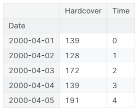

# Time Series
## Definition
It is a set of subsequent observations recorded over time. They are typically recorded with a regular and fixed 
frequency (e.g., hourly, daily, monthly, etc.).

## Features
There are different types of features when talking about Time Series:
- *Time-Step Features*
- *Lag Features*

### Time-Step Features
Time-step features are features we can derive directly from the time index. 
The most basic time-step feature is the **Time Dummy**, which counts off time steps in the series from beginning to end.

For example, the **Time** column in the following example:

The Time-Step features model the so-called **Time Dependence**: series is time-dependent if its values can be predicted 
from the time they occurred. For example, in the *Hardcover Sales* series, the sales later in the month are
generally higher than sales earlier in the month.

### Lag Features

# Modeling
## Linear Regression
Linear regression is widely used in practice and adapts naturally to even complex forecasting tasks.

$` y = x_1 \cdot w_1 + \ldots + x_n \cdot w_n + b `$

