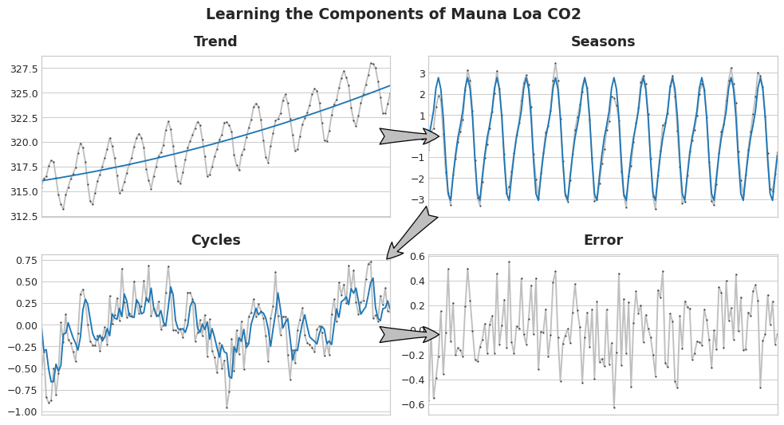
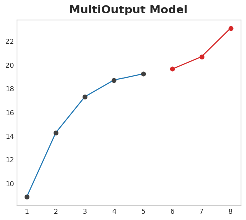
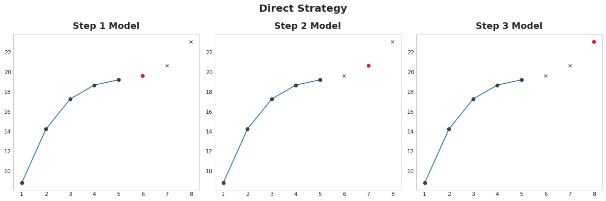
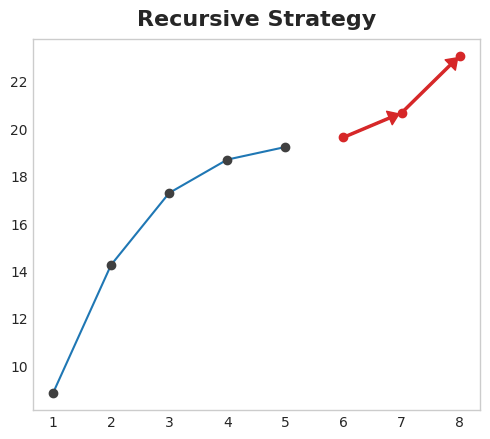
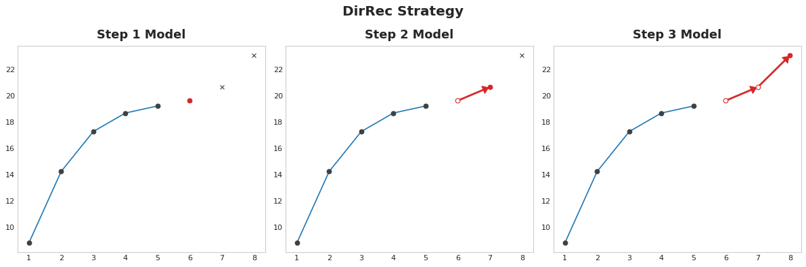
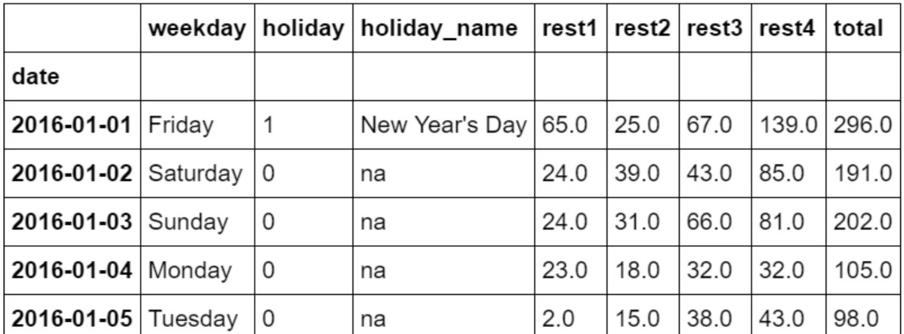

# Time-Step & Lag Features
The best time series models will usually include some combination of time-step features and lag feature.

# Linear Regression
Linear regression is widely used in practice and adapts naturally to even complex forecasting tasks.

$` y = x_1 \cdot w_1 + \ldots + x_n \cdot w_n + b `$

# Hybrid Models or ETS Models
## Introduction
Linear Regression is useful for extrapolating trends, while XGBoost excels at learning interactions. 
These two approaches can be combined in order to create a **Hybrid** forecaster.

Sometimes these models are also called ETS: **Error-Trend-Seasonality**.
They are able to model a Time Series by decomposing it into three main components:
- **Error/Resisduals**: it represents the random fluctuations or noise
- **Trend**
- **Seasonality**

Some of these ETS models are:
- *Exponential Smoothing*
- *Trend Methods Models*
- *ETS Decomposition*

ETS models can be:
- **Additive** - The trend is more linear and trend + seasonality components seem constant over time
- **Multiplicative** - It is useful to model non-linear components

## Components and Residuals
A time series can be described as: `series = trend + seasonalities + cycles + error(unpredictable part)`.

These are called the **Components** of a time series.

The **Residuals** of a model are the difference between the labels the models was trained on and the predictions the
models makes. They are essentially what the model failed to learned about the target from the features.

The learning process can be done by learning the single **components** of a time series in a **residuals** fashion:
1. Learn the trend and subtract it out from the time series
2. Learn the seasonality and subtract it out from the previous residuals of the time series
3. Learn the cycle and subtract
4. Learn the error



Adding together all the learned components will build the model. This is what a Linear Regression does when
it is trained on a complete set of features of trend, seasons and cycles.

One way to extract such components is the **Hodrick-Prescott** filter, which is used to separate the trend component
from the cyclic component of a time series.

## Hybrid Forecasting Theory
It is possible to use one algorithm upon certain components and another one upon the remaining ones.
This allows to always choose the best algorithm for a specific component.

The process involves training one model over the original time series and another one over the residuals:

```python
# 1. Train and predict with first model
model_1.fit(X_train_1, y_train)
y_pred_1 = model_1.predict(X_train)

# 2. Train and predict with second model on residuals
model_2.fit(X_train_2, y_train - y_pred_1)
y_pred_2 = model_2.predict(X_train_2)

# 3. Add to get overall predictions
y_pred = y_pred_1 + y_pred_2
```

The set of features in `X_train_1` and `X_train_2` is not the same. For example, the `X_train_1` might contain trend features,
while `X_train_2` might have seasonality and cycle features.

## Design Hybrid Forecaster
In practice, two models are just fine:
1. Linear model to learn trend
2. Complex non-linear model like GBDTs or a deep neural network for seasonality and cycles

The first simple linear model is ofter referred as a "helper" model for the more subsequent powerful one that follows.

# Multistep Forecasting Strategies
## Definition
It is a model that can predict multiple target steps.
There are four different strategies to model such a forecast.

## Strategies
**1. Multi-output Model**
The first strategy is to use a model that can handle multiple outputs naturally (e.g., Linear Regression and Neural Networks).
However, algorithms like XGBoost can not do that.



**2. Direct Strategy**
Train a separate model for each step in the **Forecast Horizon**. While this approach can be very precise, it is also
very computationally expensive.



**3. Recursive Strategy**
Train a single one-step model and use its forecasts to update the lag features for the next step. This is necessary,
since one problem with lag features is that they might not be available for a defined time step 
(e.g., it is not available for the time step number "6" in the below figure).



The main drawback, is that errors will propagate from step to step.

**4. DirRec Strategy**
A combination of the direct and recursive strategies: train a model for each step and use forecasts from 
previous steps as new lag features.



DirRec strategy can capture serial dependence better than Direct Strategy, 
but it can also suffer from error propagation like Recursive Strategy.

# Exponentially Weighted Moving Average
## Definition
Unlike Simple Moving Averages (or Moving Average), which give equal weight to all observations in a window, 
EWMA gives exponentially decreasing weights to older observations. 
This makes the EWMA more sensitive to recent changes in the data, 
which can be particularly useful for detecting trends and patterns.

## Strategy
It uses a single smoothing factors "alpha".

# Holt-Winters Methods
## Definition
It models a time series using three different equations, each one covers a component:
- l_t: level (alpha smoothing parameter)
- b_t: trend (beta smoothing parameter)
- s_t: seasonality (gamma smoothing parameter)

## Strategies
- Double Exponential Smoothing (level + trend components)
- Triple Exponential Smoothing (level + trend + seasonality components)

# ARIMA
## Introduction
It stands for *AutoRegressive Integrated Moving Average* and it is widely used.

## Drawbacks
One important aspect to consider, is that ARIMA is not well suited when the value of the Time Series is influenced by
other external factors with respect to the value itself. For example, stock price is not suited to be modelled with ARIMA,
because it is influence by many other external factors with respect to the price itself.

It is good to apply it when the value of the time series depends only on the time stamp, like for example the airline
passengers time series, where the number of passengers depends only on the time step itself.

## Types
- Non-Seasonal ARIMA
- Seasonal ARIMA (SARIMA)
- SARIMA with exogenus variables (SARIMAX)

## Process
Non-Seasonal ARIMA is applied to time series that show non-stationary behaviour (it has trend and seasonality) and
an initial differencing step is applied one or more times to eliminate the non-stationarity.

ARIMA has **Three Main Parameters**
- p - Autoregression (AR). The Autoregression uses a linear combination of the past observations to predict the next time step
value. It used the lagged features of **order p**.
- d - Integrated (I). Differencing observations (subtracting) in order to make the time series stationary. There, d is the degree 
of differencing.
- q - Moving Average (MA). A model that uses the dependency between an observations and a residual error from a moving average
applied to lagged observations. The term q is the order to the moving average model.

The main characteristics of a Stationary Time series are: constant mean, variance and covariance over time.
The **Augmented Dickey-Fuller** test is used to understand whether a time series is stationary or not (Check `statistics.md`).

Once the time series has been classified as non-stationary, it is required to be transformed into stationary in order to
evaluate it and decide what ARIMA (p, d, q) parameters to use. For this process, **Differencing** can transform the time series.

## Choose Parameters
One way to choose p and q through ACF and PACF. 

Another possibility is to use a Grid Search, because the previous mentioned
plots are sometimes very hard to read.

A library called `pmdarima` (Pyramid ARIMA) is used to performa Grid Search through AIC metric to optimise.

# SARIMA
## Introduction
It is exactly the same as ARIMA, but in addition to the parameters (p, d, q), it takes another tuple (P, D, Q) that
specifically describes the seasonal components of the model.

# SARIMAX
## Introduction
The `X` represents that the function in `statsmodels` also supports exogenous regressor variables.

## Exogenous Variables


In the example above, we want to predict the total number of visitors from 4 different restaurants (column `total`).
We can use a classic SARIMA approach, and just use the column `total`.

However, with SARIMAX we can add additional information, like the `weekday`, `holiday` and `holiday_name`.
These are called *Exogenous Variables*.

## Drawback
The main problem is that, when predicting future values, we might not have the values for
those exogenous variables and we should do a double prediction as well.

In the above example of the Restaurant Visitors, that's not a problem, because we can derive the values
of the Exogenous Variables. However, that could be the case if one Exogenous Variable is `number_tourists_in_town`.


# Vector Autoregression (VAR)
# Advantage
In SARIMAX model, the exogenous variables influence the value of the Time Series, but not vice versa (e.g., restaurants
visitors do not influence when holidays come, but the other way around). With VAR, the influence is bidirectional.

# VARMA
## Definition
It expands the VAR model by introducing the Moving Average term (MA).