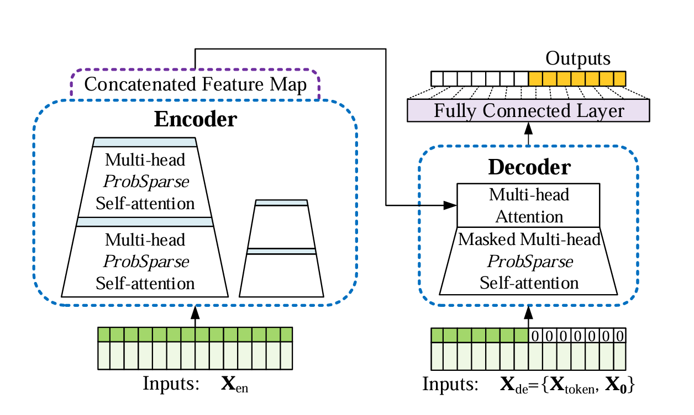

# Introduction
## Definition
They use an Encoder-Decoder architecture that works very well with sequence-to-sequence tasks.

## Advantages
- Traditional RNNs or LSTMs process sequences step-by-step and respect their order &rarr; Transformers process all tokens
simultaneously, allowing computational boosting and long-range dependencies to be captured more effectively.
    - This expands the **Local Forecasting** (step-by-step) with **Probabilistic Forecasting** &rarr; Global Probabilistic
    - To preserve the order, a Positional Encoding is required
    - It computes positional encodings and adds them into the input token embeddings that are fed into the Transformer
- Allow the LSTF (Long Sequence Time Series Forecasting) &rarr; Capture long-rage dependencies thanks to the Self-Attention mechanism

## Drawbacks
- Quadratic computation of self-attention (Time Complexity)
- High memory usage

# Self-Attention
## K, V and Q vectors
In the original Transformer architecture, the K and V vectors have dimension (sequence_length, embeddings_dimension).

This was due to the fact that the input sequence has words, which have to be encoded to be fed into a Transformer.

In the case of Time Series Forecasting, this step might not be necessary.

# Architectures
## Informer
### Definition
It is Encoder-Decoder architecture specifically designed for LSTF.
- [Paper](http://arxiv.org/abs/2012.07436)

### Process
1. Input time series is encoded in a lower dimensional representation by passing it through the Encoder 
   2. Self-Attention &rarr; Every data point is compared with every other data point &rarr; Determine correlation
   2. Probabilistic Sparse Attention &rarr; Only use a subset of the total data points for self attention
   3. Multi-Head &rarr; Above two steps happen in parallel for multiple times
   4. Distillation of used data points
   5. Another Multi-Head ProbSparse Self-Attention (Step 1 - 3)
   6. Final encoded Feature Map
2. The encoded sequence is pass to the Decoder along with part of the original sequence
   3. Pass part of the original sequence alongside with some padding (i.e., the time steps we want to predict)
   4. Pass such sequence to a Masked Multi-Head ProbSparse Self-Attention (Self-Attention that can not look into the future)
   5. Pass the output and the Encoded Feature Map to a Multi-Head Attention
   6. Pass to a Fully Connected Layer
3. The Decoder generates all the output time steps simultaneously

### Advantages
1. It generates all output time steps simultaneously

### Drawbacks of Traditional Transformers
1. Quadratic computation of self-attention &rarr; Addressed by using Probabilistic Sparse Attention and not Full Attention
2. Memory bottleneck of stacking layers for long inputs &rarr; Addressed by using Distillation for reducing memory consumption 
&rarr; Select only certain data points in the sequence after the Self Attention layer
3. Speed plunge in predicting long outputs &rarr; Addressed by Generative Inference &rarr; Parallel output of data points from the Informer
